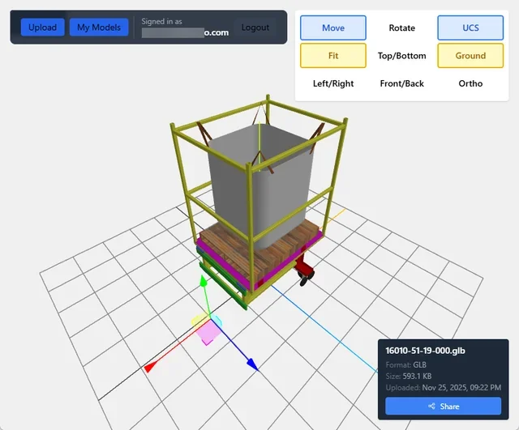

# E3D Viewer - 3D Model Viewer for Engineering & 3D Printing

A professional 3D model viewer built with Nuxt 4, Three.js, and Supabase, designed for engineering model review and 3D printing preparation. Deployed on Cloudflare Pages for fast global access.

**🚀 Live Demo:** [https://e3d.calcs.live](https://e3d.calcs.live/viewer/fwt4qufi)



## Features

### **Multi-format Support with Full Color Fidelity**
- STL (monochrome)
- **3MF** - Full color support for multi-material 3D printing models
- **GLB/GLTF** - Complete color and material data preservation for engineering models

### **User Authentication & Management**
- Secure email/password authentication via Supabase Auth
- User signup, login, and password recovery
- Session management across pages
- Public model sharing (no login required to view)

### **Interactive 3D Viewer**
- Professional CAD-style view controls (Top/Bottom, Front/Back, Left/Right)
- Perspective/Orthographic camera modes
- Move and Rotate gizmos for model manipulation
- Home/Fit zoom controls
- Grid and axes helpers for spatial reference
- Automatic model centering and scaling
- Orbit controls (rotate, pan, zoom)

### **Model Management Dashboard**
- Grid view of all user's models
- Real-time search (filename, title, tags)
- Folder filtering
- Quick actions: View, Share, Delete
- Model metadata display (size, format, upload date)

### **Folder Organization**
- Unlimited nested folder structure
- Organize models by project, client, or custom categories
- Virtual folders (e.g., `clients/acme/parts/revision-2`)
- Folder selector during upload

### **File Deduplication**
- Hybrid approach: Quick filename+size check, then SHA-256 hash
- Prevents accidental duplicate uploads within same folder
- Detects truly identical files even if renamed

### **Public Link Sharing**
- Share models via simple URL
- Anonymous viewing (no login required)
- Copy shareable link from dashboard or viewer
- Models default to public for easy collaboration

### **Cloud Infrastructure**
- Supabase Storage for scalable file hosting
- Supabase Database for metadata tracking
- Row Level Security (RLS) for data protection
- Cloudflare Pages deployment for global edge performance

## Why Color Support Matters

For engineering and 3D printing workflows, color data is critical:

- **Engineering Review**: Visualize assemblies with part identification by color, stress analysis results, and material specifications
- **3D Printing**: Preview multi-material prints with accurate color representation before sending to printer
- **Quality Control**: Identify defects, verify color coding, and validate model integrity

This viewer preserves the full color and material information embedded in **3MF** and **GLB/GLTF** formats, making it ideal for professional workflows.

## Tech Stack

- **Frontend**: Nuxt 4 + Vue 3
- **3D Graphics**: Three.js + three-stdlib
- **Storage**: Supabase
- **Styling**: Tailwind CSS
- **Deployment**: Cloudflare Pages (Nitro preset)

## Setup

### Prerequisites

- Node.js 18+
- Supabase account and project
- npm or pnpm

### 1. Install Dependencies

```bash
npm install
```

### 2. Configure Supabase

Create `.env` file in the root:

```env
SUPABASE_URL=your_supabase_project_url
SUPABASE_KEY=your_supabase_anon_key
```

### 3. Set Up Supabase Storage

In your Supabase project:

1. Navigate to **Storage** section
2. Create a new bucket named `e3d-models`
3. Set bucket to **public**
4. The app automatically organizes files by user in `users/{user_id}/` folders

### 4. Set Up Supabase Database

Run the migration script in your Supabase SQL Editor:

1. Navigate to **SQL Editor** in Supabase dashboard
2. Copy contents of `supabase-migration-update.sql`
3. Execute the script to create the `e3d_models` table with folder support
4. This enables:
   - User ownership and authentication
   - Folder organization (unlimited nesting)
   - File deduplication within folders
   - Metadata tracking (title, description, tags)
   - Privacy controls (public/private models)

### 5. Development Server

```bash
npm run dev
```

Access at http://localhost:3000 (or alternative port if occupied)

### 6. Build for Production

```bash
npm run build
```

This creates the `dist/` directory with your production-ready application.

### 7. Deploy to Cloudflare Pages

**Option A: Direct Deployment (CLI)**

```bash
npm run deploy
```

This will:
1. Build your application
2. Deploy to Cloudflare Pages using Wrangler
3. Automatically create a new project on first deployment

**Option B: Git-based Deployment (Recommended for Production)**

1. Push your code to GitHub/GitLab
2. Go to [Cloudflare Dashboard](https://dash.cloudflare.com/) → Pages
3. Click "Create a project" → "Connect to Git"
4. Select your repository
5. Configure build settings:
   - **Build command**: `npm run build`
   - **Build output directory**: `dist`
   - **Root directory**: `/` (or leave empty)
6. Add environment variables:
   - `SUPABASE_URL`: Your Supabase project URL
   - `SUPABASE_KEY`: Your Supabase anonymous key
7. Click "Save and Deploy"

**Important**: After deployment, remember to set up environment variables in the Cloudflare Pages dashboard for your Supabase credentials.

## Project Structure

```
e3d-viewer/
├── app/
│   ├── assets/css/
│   │   └── main.css                  # Tailwind styles
│   ├── components/
│   │   └── Viewer3D.vue              # Three.js viewer component
│   ├── composables/
│   │   ├── use3DModel.ts             # Model upload/storage/deduplication
│   │   ├── useAuth.ts                # Authentication helpers
│   │   └── useSupabase.ts            # Supabase client
│   ├── pages/
│   │   ├── index.vue                 # Upload interface
│   │   ├── dashboard.vue             # My Models dashboard
│   │   ├── viewer/[filename].vue     # 3D viewer page
│   │   └── auth/
│   │       ├── login.vue             # Login page
│   │       ├── signup.vue            # Signup page
│   │       └── forgot-password.vue   # Password recovery
│   └── app.vue
├── nuxt.config.ts                    # Nuxt configuration
├── tailwind.config.ts                # Tailwind config
├── wrangler.jsonc                    # Cloudflare config
├── supabase-migration-update.sql     # Database schema migration
├── SUPABASE_SETUP.md                 # Detailed Supabase setup guide
└── CLAUDE.md                         # Implementation details & roadmap
```

## Usage

### **Upload Models**
1. Navigate to home page (Upload)
2. Sign in if not already authenticated
3. Select a folder (optional) or create new folder
4. Click upload area and select 3D model file (STL, 3MF, GLB, GLTF)
5. Automatically redirected to interactive viewer
6. Model is saved and appears in "My Models" dashboard

### **View Models**
1. **From Dashboard**: Click "View" on any model card
2. **From Link**: Share link with anyone (no login required)
3. **3D Viewer Controls**:
   - **Mouse drag**: Rotate view
   - **Right-click drag**: Pan view
   - **Scroll**: Zoom in/out
   - **Move/Rotate buttons**: Toggle gizmo mode
   - **View buttons**: Switch to Top/Bottom/Front/Back/Left/Right views
   - **Ortho/Persp**: Toggle camera projection mode
   - **Home/Fit**: Reset camera or fit model to view
   - **UCS/Ground**: Toggle axes and grid display

### **Manage Models**
1. Click "My Models" from any page
2. **Search**: Type to filter by filename or tags
3. **Filter**: Select folder from dropdown
4. **Actions**:
   - **View**: Open in 3D viewer
   - **Share**: Copy shareable link to clipboard
   - **Delete**: Remove model (with confirmation)

## Supported Formats

| Format | Color Support | Best For |
|--------|--------------|----------|
| **3MF** | **Yes - Full color** | Multi-material 3D printing, colored models |
| **GLB** | **Yes - Full color + materials** | Engineering models, textured assets |
| **GLTF** | **Yes - Full color + materials** | Web-optimized engineering models |
| **STL** | No (monochrome) | Simple geometry, legacy files |

## Configuration

### Environment Variables

Required in `.env`:
- `SUPABASE_URL` - Your Supabase project URL
- `SUPABASE_KEY` - Your Supabase anonymous/public key

### Nuxt Config

- **Modules**: @nuxtjs/tailwindcss, @nuxtjs/supabase, nitro-cloudflare-dev
- **Nitro Preset**: cloudflare-pages
- **Cloudflare**: Node compatibility enabled

## Troubleshooting

**Deployment: ASSETS Binding Error**
```
Error: The name 'ASSETS' is reserved in Pages projects
```
- **Solution**: Use `npm run deploy` or `wrangler pages deploy dist`
- **DO NOT** use `wrangler deploy` (that's for Workers, not Pages)
- The project is configured for Cloudflare Pages, not Workers

**Upload Failures**
- Verify `.env` contains correct Supabase credentials
- Confirm `e3d-models` bucket exists and is **public**
- Ensure user is authenticated (uploads require login)
- Check storage quota limits in Supabase dashboard
- Verify bucket CORS is configured to allow browser uploads
- Run the database migration script if not already done

**Model Won't Display**
- Verify file is valid 3D model format
- Check browser console for loading errors
- Ensure Supabase bucket is set to **public** access
- Test the Supabase public URL directly in browser

**Color Not Showing**
- STL format does not support color - use 3MF or GLB/GLTF instead
- Verify color data exists in source file (check in another viewer)
- Ensure model was exported with material/color information

**Dev Server Issues**
- Auto-selects alternative port if 3000 occupied
- Ensure all dependencies installed: `npm install`
- Verify `.env` file exists with valid credentials
- Clear `.nuxt` cache: `rm -rf .nuxt` then rebuild

**Environment Variables Not Working in Production**
- Add environment variables in Cloudflare Pages dashboard
- Go to Settings → Environment Variables
- Add both `SUPABASE_URL` and `SUPABASE_KEY`
- Redeploy after adding variables

## License

MIT
